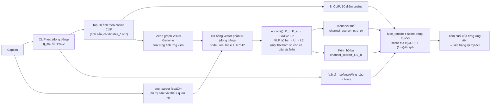

# Mô hình re-ranker đồ thị cấp độ 1, theo code hiện tại

Tài liệu mô tả đúng những gì code đang làm ở commit `268b5b6` trên nhánh `feat/graph-reranker-model`. Không chép từ plan:
mọi số đo (số tham số, kích thước, khởi tạo, thời gian) lấy bằng cách khởi tạo mô hình thật và đọc code.
Code chính: [src/models/graph_reranker.py](../src/models/graph_reranker.py),
[src/data/graph_store.py](../src/data/graph_store.py), [src/train_graph_reranker.py](../src/train_graph_reranker.py).
Người viết code: Lộc (cùng agent Codex và Claude, ghi trong commit); người viết tài liệu: Claude, theo yêu cầu của Lộc ngày 2026-09-23.

## 1. Luồng dữ liệu cho một cặp (câu, ảnh)

Mọi vector đầu vào đều tính sẵn một lần bằng **CLIP ViT-B/32 (bản QuickGELU, trọng số OpenAI, qua `open_clip`), đóng băng,
512 chiều, đã chuẩn hoá L2**. CLIP không nằm trong mô hình huấn luyện và không nhận gradient.



Chi tiết từng bước, kèm kích thước:

1. **Kênh CLIP.** `clip_scores[q, k]` = cosine giữa vector CLIP của caption và vector CLIP của ảnh ứng viên thứ k,
   lấy sẵn từ `candidates_{train,val}.npz`. Vector ảnh không vào mô hình, chỉ con số cosine này vào.
2. **Vector câu** `q_câu` (512, dòng của caption trong `vg_coco_caption.npy`) chỉ dùng để tính ba trọng số a, b, c.
   Nó không đi vào đồ thị.
3. **Đồ thị ảnh** (`data/graphs/vg_coco_scene_graphs.jsonl`, dựng bởi `scripts/build_graph_data.py`): mỗi ảnh một đồ thị
   riêng lấy từ `objects.json` + `relationships.json` của Visual Genome. Nhãn mở đã chuẩn hoá alias, không lọc VG150.
   Mỗi instance là một node, kể cả khi trùng nhãn. Quan hệ có hướng, trùng cả ba (chủ, nhãn, đối) thì gộp. Không có cạnh
   nối giữa các ảnh, không có ConceptNet. Trên 49 070 ảnh train+val: trung bình 26,7 node (trung vị 26, tối đa 150),
   18,0 cạnh (tối đa 126); 3,0% ảnh không có cạnh nào.
4. **Đồ thị câu** (`data/processed/query_graphs_{split}.json`): `parse_caption` gọi `sng_parser`. Node = `lemma_head`
   của từng thực thể, viết thường; cạnh = quan hệ mà parser trả về. Lúc dùng (`GraphStore._graph_parts(query=True)`),
   các đại từ trong `PRONOUNS` bị bỏ cùng các cạnh chạm vào chúng, và nhãn quan hệ được viết thường. Node có tên rỗng vẫn
   nằm trong đồ thị (để GAT lan truyền) nhưng có `part_mask = False` nên không được chấm. Trung bình 3,06 node và
   1,65 cạnh mỗi câu; 14,2% câu val không có bộ ba nào.
5. **Bảng vector phần tử, đóng băng** (`vg_coco_graph_parts.npy`, 582 085 × 512, float32): 71 388 khoá `node:<nhãn>`
   được mã hoá bằng prompt `"a photo of a {nhãn}"`, 21 088 khoá `rel:<nhãn>` mã hoá nguyên văn, 489 609 khoá
   `triple:<chủ> <quan hệ> <đối>` mã hoá nguyên văn. Bảng gồm chữ của cả ba split. Encoder đóng băng nên không có gì
   được khớp trên test; điểm số trên test chưa hề được tính.
6. **Tính sẵn chỉ số** (`GraphIndex`, từ commit `67448ba`): lúc khởi động, mỗi đồ thị train/val được đổi một lần thành
   các mảng số nguyên (dòng trong bảng cho node / quan hệ / bộ ba, và `edge_index` cục bộ). Mỗi batch chỉ gom chỉ số
   rồi lấy vector bằng `table[rows]` trên GPU. Kết quả `PackedBatch` giống từng bit với `Batch.from_data_list` của PyG
   (có test).
7. **`encode()`** chạy trên mọi ảnh ứng viên (một lần cho mỗi ảnh duy nhất trong batch) và trên mọi câu. Kết quả là các
   vector phần tử `p` ∈ R^512 đã L2 cho vật thể và cho bộ ba, sắp dạng dense `[số đồ thị, số phần tử tối đa, 512]` kèm mask.
8. **`channel_score`** chấm hai kênh: vật thể của câu với vật thể của ảnh, bộ ba của câu với bộ ba của ảnh, không khớp
   chéo. Đầu ra là ma trận `[B, 50]` cho mỗi kênh, NaN khi câu hoặc ảnh không có phần tử nào trong kênh đó.
9. **`fuse_tensor`** z-score từng kênh trong top-50 của chính câu đó rồi trộn thành điểm cuối `[B, 50]`.

## 2. Kiến trúc từng module

Mọi tham số dùng chung cho đồ thị ảnh và đồ thị câu.

| Ký hiệu | Lớp trong code | Vào → ra | Kích hoạt / dropout | Khởi tạo |
|---|---|---|---|---|
| `P_n` | `p_node = nn.Linear(512, 256)` | vector node 512 → 256 | không | mặc định PyTorch (Kaiming uniform) |
| `P_e` | `p_edge = nn.Linear(512, 256)` | vector quan hệ 512 → 256, dùng cho `edge_attr` của GAT và cho MLP bộ ba | không | mặc định |
| GAT lớp 1 | `gat1 = GATv2Conv(256, 64, heads=4, edge_dim=256, fill_value=0., dropout=0.1)` | 256 → 4×64 = 256 (ghép các head) | ELU, rồi `nn.Dropout(0.1)`; `dropout=0.1` bên trong là dropout trên hệ số attention | mặc định PyG (glorot) |
| GAT lớp 2 | `gat2`, giống lớp 1 | 256 → 256 | ELU, dropout 0,1 | mặc định PyG |
| MLP bộ ba | `triple_mlp = Sequential(Linear(768,256), ReLU, Dropout(0.1), Linear(256,256))` | `[h_chủ ‖ P_e(quan hệ) ‖ h_đối]` 768 → 256 | ReLU, dropout 0,1 | mặc định |
| `U` | `u = nn.Linear(256, 512, bias=False)` | 256 → 512, dùng chung cho node và bộ ba | không | **0** (`nn.init.zeros_`) |
| `u_o`, `u_t` | `u_objects`, `u_triples` | vector 512, cho trọng số phần tử phía câu | không | **0** |
| `τ_o`, `τ_t` | `exp(log_tau_*)` clamp [0,01; 1] | vô hướng | không | **0,05** |
| `T` | `exp(log_temperature)` clamp [0,05; 5] | vô hướng, nhiệt độ của loss | không | **1** |
| `W` | `weight_map`, 3 × 512 | `q_câu` → 3 logit | softmax | **0** |
| `bias` | `weight_bias`, 3 | cộng vào logit | softmax | **log(0,60; 0,28; 0,12)** |

Các bước trong `encode()` (dòng 97–125):

```text
h   = P_n(f_node)                                   # 256
h   = dropout(ELU(GATv2_1(h, edge_index, P_e(f_rel))))   # có self-loop, edge_attr của self-loop = 0
h   = dropout(ELU(GATv2_2(h, edge_index, P_e(f_rel))))
p_node   = L2(f_node + U·h)                          # 512, dòng 106
g        = MLP([h_src ‖ P_e(f_rel) ‖ h_dst])         # 256, dòng 109
p_triple = L2(f_triple + U·g)                        # 512, dòng 110
```

**Vì sao bước 0 trùng mốc 43,50.** Với `U = 0` thì `p = L2(f) = f` (các vector đã L2 sẵn), tức mô hình dùng đúng
vector CLIP text đóng băng như phép thử không huấn luyện. Với `u_o = u_t = 0`, trọng số phần tử phía câu đều nhau.
Với `W = 0`, (a, b, c) = (0,60; 0,28; 0,12) cho mọi câu, tương đương α = 0,6, β = b/(b+c) = 0,7. Với
τ_o = τ_t = 0,05 đúng như phép thử. Kiểm tra `scripts/checks/step0_reference_check.py` cho R@1 val = 0,43496661337346
và 200 câu đầu lệch tối đa 1,96e-5 (ở `z_objects`; điểm trộn lệch 5,9e-6) so với `three_channel_probe_reference_scores.npz`. Hệ quả phụ: lúc khởi tạo, `U = 0`
chặn gradient về GAT, `P_n`, `P_e` và MLP. Bước tối ưu đầu tiên chỉ cập nhật `U`, `u_*`, τ và `T`; các module phía
trước bắt đầu học từ bước thứ hai (test `test_zero_init_and_missing_gradients_are_finite`).

## 3. Số tham số

Đếm bằng `sum(p.numel())` trên `GraphReranker()` khởi tạo thật.

| Module | Tham số | Trainable |
|---|---:|---|
| `p_node` (P_n) | 131 328 | có |
| `p_edge` (P_e) | 131 328 | có |
| `gat1` | 197 632 | có |
| `gat2` | 197 632 | có |
| `triple_mlp` | 262 656 | có |
| `u` (U) | 131 072 | có |
| `u_objects`, `u_triples` | 512 + 512 | có |
| `log_tau_objects`, `log_tau_triples`, `log_temperature` | 1 + 1 + 1 | có |
| `weight_map` (W) | 1 536 | có, trừ khi tắt `adaptive_weights`; khoá trong epoch 1 |
| `weight_bias` | 3 | có; khoá trong epoch 1 |
| **Tổng trainable** | **1 054 214** | |
| CLIP ViT-B/32 (ảnh + text) | không nằm trong mô hình | đóng băng; chỉ dùng để tính sẵn vector và cosine |
| Bảng vector phần tử 582 085 × 512 | không phải tham số | đóng băng, chỉ đọc |

Mỗi lớp `GATv2Conv(256, 64, heads=4, edge_dim=256)` gồm `lin_l` 65 792, `lin_r` 65 792, `lin_edge` 65 536 (không bias),
`att` 256, `bias` 256.

## 4. Hàm điểm và fusion

**Mỗi kênh** (`channel_score`, dòng 47–57). Với câu có các phần tử `i` và ảnh ứng viên có các phần tử `j` cùng loại:

```text
sim_ij = p_i · p_j                              # cosine, dòng 51
a_ij   = softmax_j(sim_ij / τ) (có mask)        # dòng 52: phần nào của ẢNH trả lời phần i của câu
s_i    = Σ_j a_ij · sim_ij                       # dòng 53
w_i    = softmax_i(u · p_i) (có mask)           # dòng 54: phần nào của CÂU quan trọng
S      = Σ_i w_i · s_i                           # dòng 55
S      = NaN nếu câu hoặc ảnh không có phần tử nào trong kênh   # dòng 56
```

Kênh vật thể dùng `τ_o`, `u_o`; kênh bộ ba dùng `τ_t`, `u_t`. Lúc huấn luyện, hai lời gọi này bọc trong
`torch.utils.checkpoint` để tiết kiệm bộ nhớ (dòng 137–138); phép tính không đổi.

**Ba trọng số theo từng câu** (dòng 141): `[a, b, c] = softmax(W · q_câu + bias)`.

**z-score** (`zscore_tensor`, dòng 13–25): trên 50 ứng viên của một câu, bỏ qua giá trị NaN, dùng std của tổng thể
(chia n), `z = (x − mean) / (std + 1e-6)`. Ứng viên thiếu thì z = 0. Kênh không hoạt động (dưới 2 giá trị hoặc
var < 1e-12) thì cả hàng z = 0.

**Trộn** (`fuse_tensor`, dòng 28–37):

```text
mix   = (b·z(S_obj) + c·z(S_tri)) / (b + c)                     # dòng 32
Graph = z(mix)            nếu cả hai kênh hoạt động              # dòng 34
      = z(S_obj) / z(S_tri)  nếu chỉ một kênh hoạt động
      = 0                 nếu không kênh nào hoạt động
score = a·z(S_CLIP) + (1 − a)·Graph                               # dòng 36
```

Đây đúng công thức `α·z(CLIP) + (1−α)·z(Graph)` của đề với α = a, và β = b/(b+c) nằm trong định nghĩa của Graph.

**Loss** (`batch_loss`, train dòng 55): `cross_entropy(score / T, vị trí của ảnh đúng trong top-50)`.

## 5. Huấn luyện

| Mục | Giá trị trong code |
|---|---|
| Dữ liệu train | 46 944 ảnh train chia cố định thành 22 nhóm 2 133–2 134 ảnh (seed 0 của config, `data/splits/vg_coco_train_groups.json`); không có tập dev |
| Ứng viên train | top-50 CLIP của mỗi caption **trong nhóm của ảnh đúng**; 234 854 caption, bỏ 8 062 caption (3,4%) có ảnh đúng ngoài top-50, còn 226 792 |
| Ứng viên val | top-50 CLIP trên toàn bộ 2 126 ảnh val (`top50_val.json` của baseline); 10 633 caption, giữ cả 349 caption có ảnh đúng ngoài top-50 (tính là trượt) |
| Loss | softmax cross-entropy trên 50 ứng viên của điểm đã trộn chia cho `T`; một loss duy nhất |
| Optimizer | AdamW, lr 1e-3, không có lịch lr |
| Weight decay | 1e-4 cho mọi trọng số và bias của các lớp, `U`, `u_o`, `u_t`, `W`; 0 cho `log_tau_*`, `log_temperature`, `weight_bias` |
| Batch | hiệu dụng 256 câu; micro-batch mặc định 128 (lớn nhất vừa GPU 24 GB, micro 256 tràn bộ nhớ), cộng dồn gradient, mỗi micro-batch nhân `len(part)/len(batch)` |
| Thứ tự | xáo mỗi epoch, xác định bởi `SeedSequence([seed, epoch])` |
| Warm-up cổng | epoch 1: `W` và `bias` bị khoá (`set_epoch`), chỉ các phần đồ thị học; từ epoch 2 mở cả hai (`W` chỉ mở khi `adaptive_weights`) |
| Dropout | 0,1 (sau mỗi lớp GAT, trong attention GATv2, trong MLP bộ ba); tắt khi chấm val |
| Dừng sớm | theo R@1 val cuối mỗi epoch; dừng khi 2 epoch liền không tăng; tối đa 10 epoch; giữ `checkpoint_best.pt` |
| Checkpoint | `checkpoint_last.pt` mỗi epoch (model, optimizer, epoch, best, stale, metrics, trạng thái RNG); `--resume` chạy tiếp y như chạy liền (test trên CPU) |
| Seed | 0, 1, 2; `set_seed` cố định Python, NumPy, torch, CUDA, cuDNN deterministic. Scatter của PyG trên GPU không tất định nên hai lần chạy cùng seed có thể lệch nhẹ |
| Thời gian | ~286 s mỗi epoch trên RTX 4090 ở micro-batch 128, gồm cả chấm val; các run `_r2` dừng sau 5–10 epoch, tức khoảng 25–50 phút mỗi run |
| Val dùng cho | dừng sớm, chọn checkpoint tốt nhất, so các ablation. Không dùng để quét α |
| Test | GraphStore từ chối nạp test (`splits` chỉ gồm train/val); chưa có `candidates_test.npz`; chưa tính điểm mô hình nào trên test |

## 6. Cờ ablation

Mỗi cờ là một mô hình huấn luyện lại từ đầu với cùng công thức huấn luyện. Cột cuối là số tham số thật sự nằm trên
đường tính của loss. Con số này đếm theo cấu trúc và khớp với phép đếm tham số có gradient khác 0 trên một batch nhỏ
(phần lệch nhỏ khi đếm thực nghiệm là do đơn vị ReLU chết trên batch đó).

| Cờ | Tắt đúng cái gì trong code | Tham số trainable còn tác dụng |
|---|---|---:|
| (đầy đủ) | — | 1 054 214 |
| `--no-use-gat` | bỏ hai lớp GAT; `h = P_n(f)` đi thẳng vào `U` và MLP bộ ba; `P_e` vẫn dùng cho MLP bộ ba | 658 950 (mất `gat1`, `gat2`) |
| `--no-use-triple-channel` | không tính MLP bộ ba, mask kênh bộ ba = 0, đặt c = 0 rồi chuẩn hoá lại a, b; GAT vẫn dùng cạnh quan hệ | 790 532 (mất `triple_mlp`, `u_t`, `τ_t`, và hàng thứ 3 của `W` cùng `bias[2]`, vì sau khi chuẩn hoá lại a/(a+b) không phụ thuộc logit thứ ba) |
| `--no-use-edges` | GAT chạy với 0 cạnh (chỉ còn self-loop với `edge_attr = 0`), kênh bộ ba tắt như trên. Khi mỗi node chỉ có self-loop, softmax attention trên một phần tử luôn bằng 1, nên GAT thành MLP hai lớp trên từng node | 396 036 (mất thêm `P_e`, `lin_edge`, `lin_r`, `att` của cả hai lớp GAT) |
| `--no-adaptive-weights` | `W` khoá ở 0 và không có trong optimizer; `bias` vẫn học sau epoch 1, nên a, b, c là ba hằng số học trên train, dùng chung cho mọi câu | 1 052 678 |
| `--no-query-graph-encoder` | phía câu dùng thẳng `f` (không GAT, không MLP bộ ba, không `U`); phía ảnh giữ nguyên | 1 054 214 (không mất module nào, vì ảnh vẫn dùng mọi module) |

Các đối chứng phá dữ liệu đồ thị (đồ thị của ảnh khác, nối lại cạnh giữ bậc) **chưa có trong code**.

## 7. Chỗ code khác plan v7

Plan: `local-docs/plans/level1-graph-reranker-plan.md`, bản 7, 2026-09-20.

1. **Dòng "a, b, c cố định" không quét trên val.** Plan ghi dòng này là "a, b, c cố định quét trên val" để khớp chữ
   "chọn α trên validation" của đề. Code (`--no-adaptive-weights`) học ba hằng số trên train qua `bias`. Chưa có script
   quét α trên val cho mô hình đã huấn luyện. Nếu muốn đúng plan thì cần thêm một bước quét α (hoặc a, b, c) trên val
   dùng checkpoint của dòng này.
2. **Ngưỡng kiểm tra bước 0 là 1e-4, không phải 1e-5.** Plan ghi "sai số ≤ 1e-5". Script kiểm tra dùng `atol = 1e-4`
   cho 200 câu đầu và ±1e-6 cho R@1 toàn val. Lệch đo được là 1,96e-5 ở `z_objects`, lớn hơn 1e-5 của plan. Thứ hạng
   giống hệt và R@1 khớp đến 1e-14. Nguồn lệch là float32 (torch, batch) so với NumPy của phép thử. Ngưỡng không bị nới
   trong đợt này; đây là ngưỡng đã có từ khi viết script.
3. **Hai đối chứng phá đồ thị chưa được cài** ("scene graph của ảnh khác", "nối lại cạnh" lúc đánh giá và lúc huấn
   luyện lại). Plan có hai dòng này trong bảng kết quả.
4. **Micro-batch và cộng dồn gradient** không có trong plan: batch 256 một lần không vừa GPU, nên code cộng dồn
   2 × 128. Toán học tương đương batch 256 (có test).
5. **Weight decay 1e-4 cố định** trên W, U, u và các lớp. Plan để "nếu cần thì chọn trên val"; chưa ai chọn, giá trị
   1e-4 có từ khi viết code.
6. **Dropout trong attention của GATv2** (`dropout=0.1` của `GATv2Conv`) được bật thêm, ngoài dropout 0,1 sau mỗi lớp
   mà plan ghi.
7. **File kết quả ghi hash của `candidates_{train,val}.npz` và commit git**, không ghi riêng seed chia 22 nhóm và hash
   file split như plan. Hai thông tin đó nằm trong `candidates_train.npz` (`seed`, `train_split_sha256`) và trong
   `vg_coco_train_groups.json`.
8. **Thuộc tính (tính từ) không có trong mô hình.** Plan v7 không nhắc thuộc tính. Phép thử 2026-09-21 cho mức tăng
   +0,0036 < 0,005 nên không đưa vào (`experiments/checks/attribute-probe.REPORT.md`). Nêu ở đây cho đủ.
9. **Chỗ plan chỉ ước lượng.** Plan ước "dưới 1 giờ mỗi seed". Đo thật: ~286 s/epoch với đường dữ liệu mới
   (trước đó ~490 s ở micro 256 và ~2 780 s ở micro 32).

Các phần còn lại khớp plan: 3 kênh, a, b, c bằng một softmax từ `q_câu`, `W = 0` và bias log(0,60/0,28/0,12), hai lớp
softmax trong kênh, `U` 256 → 512 khởi tạo 0 dùng chung, τ và T tham số hoá bằng `exp` có clamp đúng khoảng, z-score và
cách xử lý kênh thiếu, một loss duy nhất, khoá cổng trong epoch 1, AdamW lr 1e-3, batch 256, dừng sớm sau 2 epoch không
tăng, tối đa 10 epoch, ứng viên train trong nhóm và bỏ caption có ảnh đúng ngoài top-50, định nghĩa các ablation huấn
luyện lại từ đầu.
